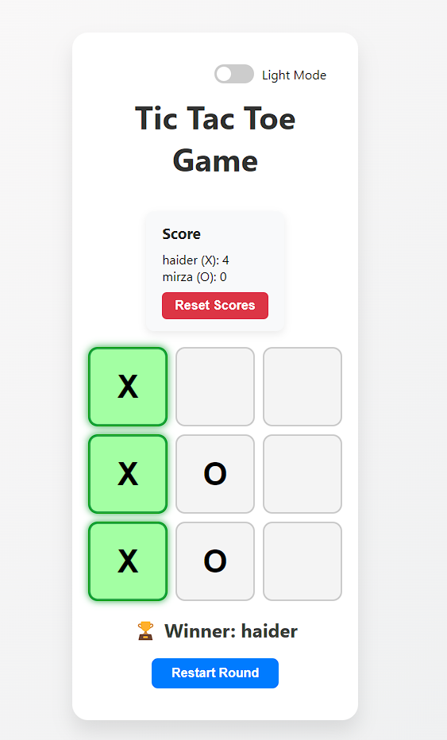

# 🎮 Tic Tac Toe Game (React)

A responsive, modern **Tic Tac Toe** game built with **React.js**. It includes **player name input**, **score tracking**, **persistent score with localStorage**, and a sleek **dark mode toggle** for a stylish experience.

---

## 🖼️ Demo


---

## 🚀 Features

✅ Player name input (for X and O)  
✅ Dark mode toggle 🌙  
✅ Win detection with visual highlights  
✅ Score tracking and localStorage persistence  
✅ Reset scores button  
✅ Fully responsive and mobile-friendly  
✅ Clean and modern UI with animations

---

## 🛠️ Tech Stack

- **React.js**
- **CSS3** (custom styling, gradients, transitions)
- **LocalStorage** (for persistent scores and themes)
- **React Hooks** (`useState`, `useEffect`)

---

## 📂 Folder Structure

```

tic-tac-toe/
│
├── public/
├── src/
│   ├── components/
│   │   └── Board.js
│   ├── App.js
│   ├── App.css
│   └── index.js
└── README.md

````

---

## 📦 Installation

```bash
git clone https://github.com/Haidermirza7072/Tic-Toe-Game.git
cd tic-tac-toe-react
npm install
npm start
````

---

## 🎮 How to Play

1. Enter names for **Player X** and **Player O**.
2. Click **Start Game**.
3. Take turns clicking the grid squares.
4. First to align 3 symbols (X or O) wins!
5. Reset scores anytime using the "Reset Scores" button.
6. Toggle between **Light and Dark** mode using the switch.

---

## 🌑 Dark Mode Preview

```js
// Sample toggle state
const [isDarkMode, setIsDarkMode] = useState(false);
```

Styled with themed classes and CSS transitions for a smooth experience.

---

## 📌 Future Improvements (optional)

* Add sound effects 🎵
* Emoji support for players
* Two-player online multiplayer (via sockets)
* Game history (Win/Draw list)

---

## 🙌 Author

Built with ❤️ by [Haider Mirza](https://github.com/Haidermirza7072)
Feel free to fork, use, and enhance!

# Tic-Toe-Game